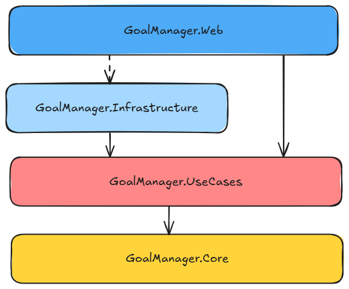
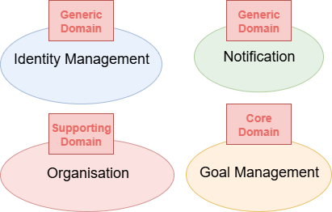
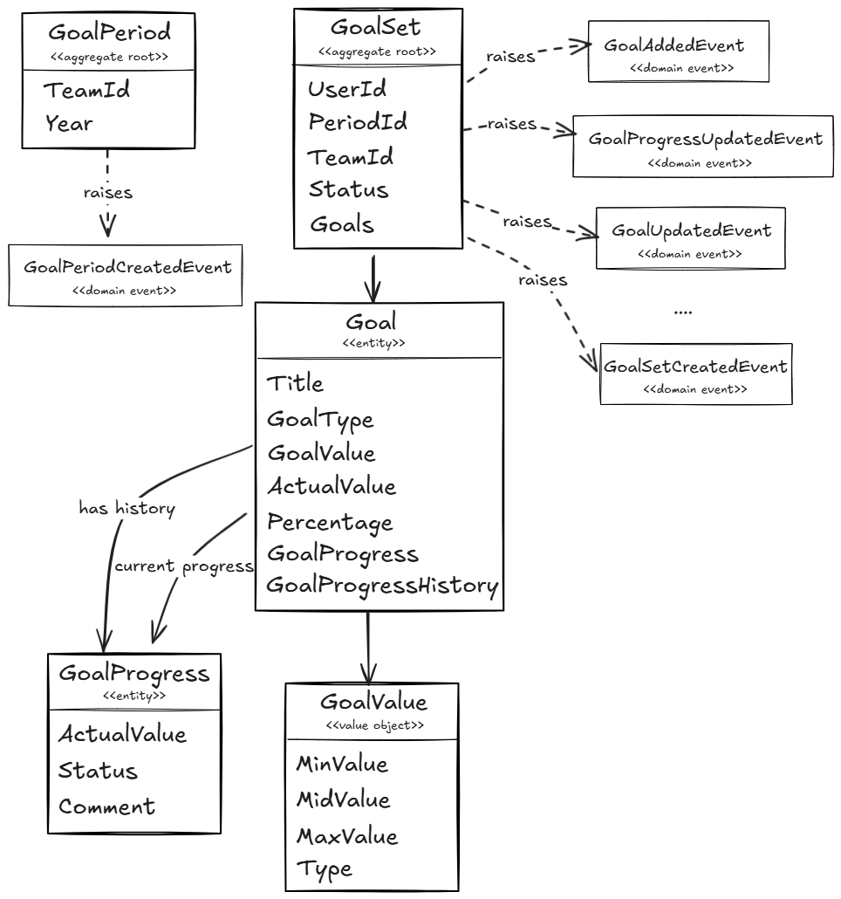

# DDD (Domain-Driven-Design) ile Goal Management System Uygulaması

Domain driven design kullanarak oluşturulmuş olan *Goal Management System* implementasyonunu içeren örnek uygulamadır.

## Proje Mimarisi

Projede Clean Architecture mimarisi kullanılmıştır. Clean Architecture `Business Domain`'i uygulamanın merkezine yerleştirir. `Infrastructure`, `UI` gibi katmanlar `Business Domain` ve `Application` katmanlarına bağımlıdır.

Aşağıdaki diagramda Clean Architecture'ın tanımlamış olduğu katmanlar gösterilmiştir.

- En merkezde Business Domain'i içeren `Entities` katmanı bulunmaktadır.
- Bir üst katmanda Application kurallarını içeren `Use Cases` katmanı vardır.
- Onun bir üstünde dış sistemler (UI, External API vs.) ile Core Business (Use Cases, Entities) veri akışını düzenleyen `Interface Adapters` katmanı bulunmaktadır.
- En üst katmanda da veri tabanı, email provider, ui frameworkler, apiler gibi dış sistemler ve infrastructure elementlerini içeren `Framework & Drivers` katmanı bulunmaktadır.

İç katmanlardan dış katmanlardaki implementasyonlara doğrudan erişilemez. Bunun yerine iç katmanlar, iç katmanda yaratılmış Interface'lere erişir, Interface'leri de dış katmanlar implemente eder. Böylece iç katman, dış katmanın implementasyonuna değil, Interface'ine bağımlıdır (Dependency Inversion).

Goal Manager DDD projes [ardalis/cleanarchitecture](https://github.com/ardalis/cleanarchitecture) template'ini kullanmaktadır. Projenin bağımlılık diagramı aşağıdaki gibidir.

- *Entities Katmanı*: GoalManager.Core
- *Use Cases Katmanı*: GoalManager.UseCases
- *Frameworks & Drivers Katmanı*: GoalManager.Web ve GoalManager.Infrastructure

> Not: Ardalis clean architecture template'inde *Interface Adapters* şeklinde açıkça adlandırılan bir katman yoktur. Ancak bu katmanın işlevini gören, core application ile dış servisler (UI, DB, API vs) arasındaki veri dönüşümünü sağlayan yapılar Infrastructure, Web, Use Cases katmanlarının içerisinde mevcuttur.

Uygulamanın Domain Driven Design kısmı `GoalManager.Core` ve `GoalManager.UseCases` projelerini kapsamaktadır.

GoalManager.UseCases

- Application Services

GoalManager.Core

- Entities
- Aggregates
- Value Objects
- Domain Events
- Domain Services

## Eventstorming Diagram

## Strategic Design

### Diagram

### Identity Management

Authentication, authorization ve kullanıcı profili yönetimi işlemlerini yapar. Goal Management sistemine özel bir business domain'i olmadığı için generic sub-domain olarak değerlendirildi. Identity Management işlevini gerçekleştirebilecek piyasada birçok hazır çözüm mevcuttur ve Identity Management sub-domain'i, Goal Management sistemi içerisinde değerlendirdiğimizde rakip ürünlere karşı rekabetçi avantaj sağlama gibi bir özelliği bulunmamaktadır.

Asp.Net Core Identity kütüphanesi kullanılmıştır. Identity Management sayfaları da Identity Scaffolder ile üretilmiştir. Çok karmaşık iş kuralları barındırmadığı ve generic sub-domain olduğu için DDD kullanılmadan geliştirilmiştir.

### Organisation

Organizasyonlar, takımlar, takım üyeleri ve takım sorumluluklarının atanması gibi organizasyonel işler burada yönetilmektedir.

Ana amacı Goal Management ve Performance Evaluation core domain'lerini destekleyecek yapıyı sağlamaktadır. Goal management uygulamasının ana odağı değildir. Bu nedenlerden dolayı supporting sub-domain olarak değerlendirilmiştir.

### Goal Management

Goal management uygulamasının ana hedeflerinden birini gerçekleştirmektedir. Hedef tanımlarını, izler ve yönetir. Kullanıcıların veya organizasyonların hedeflerini yönetmelerine ve hedeflerine ulaşmalarına yardımcı olmaktadır. Uygulamayı rakiplerden farklılaştırdığı ve rekabet avantajı sağladığı için core sub-domain olarak değerlendirilmiştir.

### Performance Evaluation

Performans değerlendirmesi Goal management uygulamasının hedeflerini doğrudan etkilemektedir ve burada yapılacak kapsamlı ve anlamı değerlendirmeler uygulamanın değerini arttırarak rekabet avantajı sağlamaktadır. Bu yüzden core sub-domain olarak değerlendirilmiştir.

### Notification

Goal Management uygulamasının, hatırlatıcılar ve güncelleme gibi bildirimleri gönderen parçasıdır. Goal Management sistemine özgü bir yapı değildir. Bir çok uygulamada yer alan ve yardımcı programlar ya da harici kütüphaneler ile işlevini gerçekleştirebilen bir yapı olduğu için generic sub-domain olarak değerlendirildi.

## Tactical Design

### Organisation

Organisation bounded context'i içerisinde Organisation aggregate root nesnesi bulunmaktadır. `Organisation` içerisinde `Team` listesi. Team listesinin altında da `TeamMember` listesi bulunmaktadır.

Organisation aggregate root için geçerli olan önemli iş kuralları aşağıdaki gibidir;

- Organizasyon adı zorunludur.
- Organizasyon adı unique'dir.
- Takım adı zorunludur.
- Bir organizasyonun altındaki takımların adları unique olmalıdır.
- Bir organisayonun altında en fazla 5 takım olabilir.
- Bir takımda en fazla 10 takım üyesi olabilir.
- Bir takımda en fazla 1 tane takım lideri olabilir.

### Goal Management

Goal Management bounded context'i içerisinde hedef dönemleri ve takım üyeleri hedeflerini yönetmemize yardımcı olacak `GoalPeriod` ve `GoalSet` aggregate root nesnelerini içermektedir. Class Diyagramı ve bounded context'in diğer elemanları aşağıda listelenmektedir.

#### Aggregate Roots

- **GoalSet:** Takım üyesi hedefleri ve hedeflerin yaşam döngüsünün yönetildiği aggregate root nesnesi.
- **GoalPeriod:** Takım hedef dönemlerinin yönetildiği aggregate root nestnesi.

#### Entities

- **Goal:** GoalSet'e bağlı hedef bilgilerinin yönetildiği entity nesnesi.
- **GoalProgress:** Hedeflerin ilerlemesinin ve ilerleme tarihçesinin yönetildiği entity nesnesi.

#### Value Objects

- **GoalValue:** Min, mid, max değerler ve hedef tipinin tutulduğu value object sınıfı.

#### Domain Events

- GoalAddedEvent
- GoalPeriodCreatedEvent
- GoalProgressApprovedEvent
- GoalProgressRejectedEvent
- GoalProgressUpdatedEvent
- GoalSetApprovedEvent
- GoalSetCreatedEvent
- GoalSetRejectedEvent
- GoalSetSentToApprovalEvent
- GoalUpdatedEvent

#### İş Kuralları ve Invariant'lar

- Bir GoalSet altında en fazla 10 hedef olabilir
- Hedeflerin toplam yüzdes 100% olmalıdır
- Hedef değerleri girerken belirlenen min, mid, max birbiriyle tutarlı olmalı (min < mid < max)
- Hedef ilerleme kaydı onay iş akışı
- Statü bazlı iş akışı kontrolleri

## Kaynaklar

### Kitaplar

- Domain-Driven Design: Tackling Complexity in the Heart of Software (Eric Evans)
- Implementing Domain-Driven Design (Vaughn Vernon)
- Learning Domain-Driven Design: Aligning Software Architecture and Business Strategy (Vlad Khononov)

### Örnek Projeler

- <https://github.com/dotnet-architecture/eShopOnWeb>
- <https://github.com/ardalis/ddd-vet-sample>
- <https://github.com/ardalis/ddd-guestbook>
- <https://github.com/m-jovanovic/event-reminder>
- <https://github.com/m-jovanovic/rally-simulator>
- <https://github.com/EnLabSoftware/HRManagement>