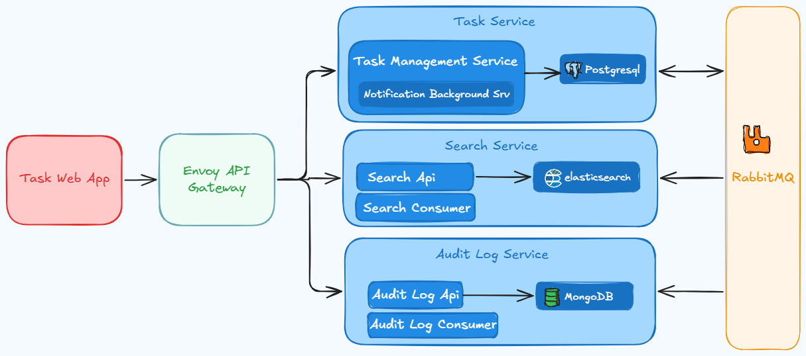

# Todo Microservice

Todo Microservice projesi web uygulaması üzerinden task *ekleme*, *silme*, *listeleme*, *filtreleme* ve *arama* yapabildiğimiz *mikroservis mimarisi* ile geliştirilmiş bir örnek uygulamadır.

## İçindekiler

- [Projeyi Çalıştırma](#projeyi-çalıştırma)
- [Erişim Noktaları (Varsayılan Portlar)](#erişim-noktaları-varsayılan-portlar)
- [Konfigürasyon / Ortam Değişkenleri](#konfigürasyon--ortam-değişkenleri)
- [Kullanılan Teknolojiler](#kullanılan-teknolojiler)
- [Ekran Görüntüsü (Todo Web App)](#ekran-görüntüsü-todo-web-app)
- [Mimari](#mimari)
- [Event Akışı (Örnek Senaryo)](#event-akışı-örnek-senaryo)
  - [Diyagram (Mermaid)](#diyagram-mermaid)
- [Gelecek Geliştirme Fikirleri](#gelecek-geliştirme-fikirleri)

## Projeyi Çalıştırma

Gereksinimler:

- .NET 9 SDK
- Docker ve Docker Compose

Komut (PowerShell / Windows):

```powershell
docker compose up -d --build
```

İlk çalıştırmada imajlar indirilecek ve container'lar ayağa kalkacaktır.

Logları izlemek için:

```powershell
docker compose logs -f taskmanagementapi
```

Durdurmak için:

```powershell
docker compose down
```

Verileri de silmek isterseniz (named volume'ları kaldırır):

```powershell
docker compose down -v
```

## Erişim Noktaları (Varsayılan Portlar)

- Web Uygulaması: [http://localhost:8084](http://localhost:8084)
- TaskManagementApi: [http://localhost:8081/swagger](http://localhost:8081/swagger)
- SearchApi: [http://localhost:8082/swagger](http://localhost:8082/swagger)
- AuditLogApi: [http://localhost:8083/swagger](http://localhost:8083/swagger)
- Envoy Gateway: [http://localhost:10000](http://localhost:10000) (örn. [http://localhost:10000/task-management/swagger](http://localhost:10000/task-management/swagger))
- RabbitMQ Yönetim Konsolu: [http://localhost:15672](http://localhost:15672) (guest / guest)
- PostgreSQL: localhost:5432
- Elasticsearch: [http://localhost:9200](http://localhost:9200)
- MongoDB: localhost:27017
- MongoClient UI: [http://localhost:3000](http://localhost:3000)

## Konfigürasyon / Ortam Değişkenleri

Örnek bazı ayarlar (docker-compose ve appsettings üzerinden):

- PostgreSQL: POSTGRES_DB, POSTGRES_USER, POSTGRES_PASSWORD
- RabbitMQ: Host, UserName, Password (appsettings.json)
- MongoDB: admin / Password1 (connection string appsettings)
- Elasticsearch: ELASTIC_PASSWORD (gerektiğinde security)

## Kullanılan Teknolojiler

- .NET 9 / ASP.NET Core Web API (TaskManagementApi, SearchApi, AuditLogApi)
- .NET 9 Worker Service (SearchWorkerService, AuditLogWorkerService)
- Entity Framework Core + PostgreSQL (Task verileri için)
- RabbitMQ (Event / Message Queue)
- Elasticsearch (Full‑text arama & filtreleme için indeks)
- MongoDB (Audit / denetim logları)
- SignalR (Gerçek zamanlı bildirimler – General Notification Hub)
- Envoy Proxy (API Gateway & Reverse Proxy, path rewrite + swagger erişimi)
- Vue.js 3 + TypeScript (TodoWebApp)
- Docker & Docker Compose (Yerel orkestrasyon)
- NEST (Elasticsearch .NET client)
- OpenAPI / Swagger (Dokümantasyon)

## Ekran Görüntüsü (Todo Web App)


## Mimari



Aşağıda mimari diyagramdaki ana komponentler özetlenmiştir:

### 1. Web Uygulaması (TodoWebApp)

Vue.js tabanlı SPA. Envoy veya direkt servis endpoint’leri üzerinden API çağrıları yapar. SignalR hub (TaskManagementApi) ile gerçek zamanlı güncellemeleri alır.

### 2. Envoy (API Gateway)

İstekleri ilgili mikroservislere yönlendirir ve path rewrite işlemlerini yapar.

- /task-management/*  -> TaskManagementApi
- /task-search/*       -> SearchApi

### 3. TaskManagementApi

Görev CRUD operasyonlarını, durum değiştirmeyi ve temel filtrelemeleri sağlar. PostgreSQL üzerinde TaskDbContext ile veriyi tutar. Her değişiklikte ilgili domain event’lerini RabbitMQ’ya yayınlar. SignalR üzerinden istemcilere anlık bildirim gönderir.

### 4. SearchApi

Elasticsearch indeksinden okuma yaparak gelişmiş arama ve filtreleme sağlar (write işlemleri yoktur, yalnızca indekslenmiş veriyi döner). Indeks güncellemeleri SearchWorkerService tarafından yapılır.

### 5. AuditLogApi

MongoDB’de tutulan denetim (audit) kayıtlarını dış dünyaya (UI veya başka servis) okuma amaçlı sunar.

### 6. SearchWorkerService

Task ile ilgili event’leri (TaskAdded, TaskUpdated, TaskStatusChanged, TaskDeleted) dinler; Elasticsearch indeksini günceller (Index / Update / Delete).

### 7. AuditLogWorkerService

Task event’lerini dinler ve AuditLog koleksiyonuna (MongoDB) ekler. Böylece değişikliklerin geçmişi tutulur.

### 8. Message Queue (RabbitMQ)

Mikroservisler arası loosely coupled asenkron iletişim. Queue & Exchange örnekleri:

- Exchanges: taskmanagement.task.added, taskmanagement.task.updated, taskmanagement.task.statuschanged, taskmanagement.task.deleted
- Queues:
  - AuditLog (AuditLogWorkerService tüketir)
  - SearchAdd, SearchUpdate, SearchStatusChange, SearchDelete (SearchWorkerService tüketir)
  - TaskManagementGeneralNotification (TaskManagementApi HostedService tüketir – SignalR broadcast amaçlı)

### 9. PostgreSQL

TaskManagementApi kalıcı veri deposu. EF Core migration başlangıcında `TaskDbContext` otomatik migrate eder.

### 10. Elasticsearch

Task’ların arama odaklı kopyası. Yüksek performanslı sorgulama için optimize. Worker eventlerinden beslenir (CQRS read model benzeri yaklaşım).

### 11. MongoDB

Audit logları append‑only formatta saklar. Ayrı bir veri modeli – sorgulama gereksinimi farklı olduğu için ayrıştırıldı.

### 12. SignalR Hub

Genel bildirimleri (ör. yeni task eklendi, güncellendi vb.) gerçek zamanlı olarak istemcilere push eder.

## Event Akışı (Örnek Senaryo)

### Diyagram (Mermaid)

```mermaid
sequenceDiagram
    autonumber
    participant User as Kullanıcı
    participant WebApp as WebApp (Vue.js)
    participant TaskManagementApi
    participant PostgreSQL
    participant RabbitMQ
    participant SearchWorker as SearchWorkerService
    participant Elasticsearch
    participant AuditWorker as AuditLogWorkerService
    participant MongoDB
    participant SignalR as SignalR Hub

    Note over User,TaskManagementApi: 1. Yeni Task oluşturma isteği
    User->>WebApp: Form doldur & Kaydet
    WebApp->>TaskManagementApi: POST /api/tasks
    TaskManagementApi->>PostgreSQL: INSERT Task
    TaskManagementApi-->>RabbitMQ: Publish TaskAdded event
    par Arama indeksleme
        RabbitMQ-->>SearchWorker: TaskAdded
        SearchWorker->>Elasticsearch: Index task
    and Audit log yazımı
        RabbitMQ-->>AuditWorker: TaskAdded
        AuditWorker->>MongoDB: Insert audit log
    end
    TaskManagementApi-->>SignalR: GeneralNotificationEvent
    SignalR-->>WebApp: taskAdded notification
    WebApp->>SearchApi: (Opsiyonel) GET /api/search?query=...
    SearchApi->>Elasticsearch: Query
    SearchApi-->>WebApp: Search results

    Note right of WebApp: Liste gerçek zamanlı güncellenir
```

1. Kullanıcı yeni Task oluşturur (POST `http://localhost:8081/api/tasks`)
2. TaskManagementApi PostgreSQL’e kaydeder ve TaskAdded event’ini RabbitMQ Exchange’ine yayınlar
3. SearchWorkerService TaskAdded mesajını tüketir -> Elasticsearch’e indexler
4. AuditLogWorkerService aynı mesajı tüketir -> MongoDB’ye audit kaydı yazar
5. TaskManagementApi iç hosted service / consumer GeneralNotificationEvent’i alıp SignalR üzerinden istemcilere push eder
6. WebApp gerçek zamanlı yeni kaydı listesine ekler

## Gelecek Geliştirme Fikirleri

- API Gateway’de rate limiting & auth eklemek
- Elasticsearch indeksine explicit mapping & analyzers
- Task etiketleme (tags) ve buna göre arama
- Prometheus + Grafana izleme
- OpenTelemetry tracing

---

Bu README ek açıklamalarla güncellenmiştir. Sorular / katkılar için PR açabilirsiniz.
